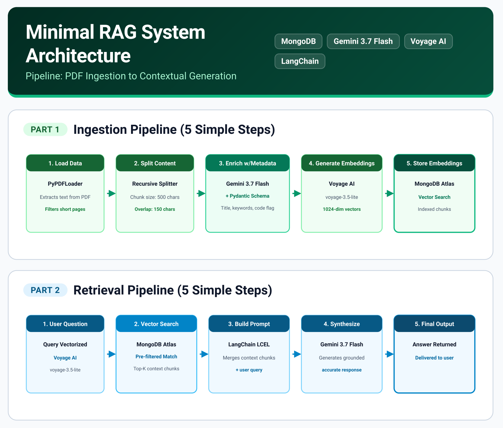

# RAG Pipeline with MongoDB Atlas, Gemini, and Voyage AI

A clean, production-minded implementation of a Retrieval-Augmented Generation (RAG) system built with Python, LangChain, MongoDB Atlas Vector Search, Google Gemini, and Voyage AI embeddings.



---

## What's different from the original course

This project started from [MongoDB University's RAG course](https://learn.mongodb.com/). The original examples were tightly coupled to OpenAI and used older LangChain APIs. I rebuilt them with:

- **Google Gemini** for generation and metadata extraction (instead of OpenAI)
- **Voyage AI** for embeddings (instead of OpenAI embeddings)
- **Current LangChain (LCEL)** instead of legacy chains
- Fixed issues in the original embeddings setup
- Added structured metadata extraction with Pydantic schemas

The goal is a working reference for anyone learning RAG with a modern, non-OpenAI stack.

---

## Architecture & Workflow

1. **Ingestion (`rag_ingest.py`)**: Loads a source PDF, filters out low-content pages, splits text into chunks, extracts structured metadata (title, keywords, code snippets presence) using Gemini and Pydantic, and stores chunks alongside vector embeddings in MongoDB Atlas.
2. **Retrieval (`rag_retrieval.py`)**: Queries the vector database using similarity search with pre-filtering, constructs contextual prompts via LangChain Expression Language (LCEL), and synthesizes grounded answers using Gemini.

---

## Tech Stack

- **Orchestration**: LangChain (`langchain`, `langchain-mongodb`, `langchain-google-genai`, `langchain-voyageai`)
- **Vector Database**: MongoDB Atlas Vector Search (`pymongo`)
- **Embeddings**: Voyage AI (`voyage-3.5-lite`)
- **LLM & Metadata Extraction**: Google Gemini (`gemini-3.7-flash`)
- **Validation**: Pydantic v2

> **Note**: Model identifiers in `key_param.py` are the source of truth. If a model name in this README is out of date, the code is correct — this is just documentation.

---

## Project Structure

```text
├── rag_ingest.py       # PDF parsing, metadata enrichment, and vector ingestion
├── rag_retrieval.py    # Vector search retrieval and RAG chain execution
├── key_param.py        # Centralized configuration and environment loader
├── requirements.txt    # Project dependencies
├── .env.example        # Required environment variables template
└── docs/
    └── minimal-rag-architecture.png

---

## Setup & Installation

### 1. Clone and Install Dependencies

```bash
git clone https://github.com/carlosoj/rag-mongodb-gemini-voyage.git
cd rag-mongodb-gemini-voyage
pip install -r requirements.txt
```
### 2. Configure Environment Variables

Create a `.env` file in the root directory based on `.env.example`:

```env
MONGODB_URI=mongodb+srv://<username>:<password>@cluster.mongodb.net/?retryWrites=true&w=majority
GEMINI_API_KEY=your_gemini_api_key_here
VOYAGE_API_KEY=your_voyage_api_key_here
SOURCE_BOOK_PATH=path/to/your/source_document.pdf
```

---

## MongoDB Atlas Vector Search Index Configuration

Before running the ingestion and retrieval scripts, create a Vector Search index in your MongoDB Atlas cluster on your target collection (`rag_example.chunked_data`).

1. Navigate to your Atlas Cluster -> **Atlas Search** tab -> **Create Index**.
2. Select **JSON Editor** and click **Next**.
3. Paste the following index definition:

```json
{
  "fields": [
    {
      "numDimensions": 1024,
      "path": "embedding",
      "similarity": "cosine",
      "type": "vector"
    },
    {
      "path": "hasCode",
      "type": "filter"
    }
  ]
}
```

Name the index vector_index and click Create Search Index

---

## Usage

### Step 1: Ingest Data

Run the ingestion script to process the PDF, extract metadata, generate embeddings, and populate MongoDB:

```bash
python rag_ingest.py
```

### Step 2: Query the RAG System
Run the retrieval script to execute vector search and generate context-aware answers:

```bash
python rag_retrieval.py
```